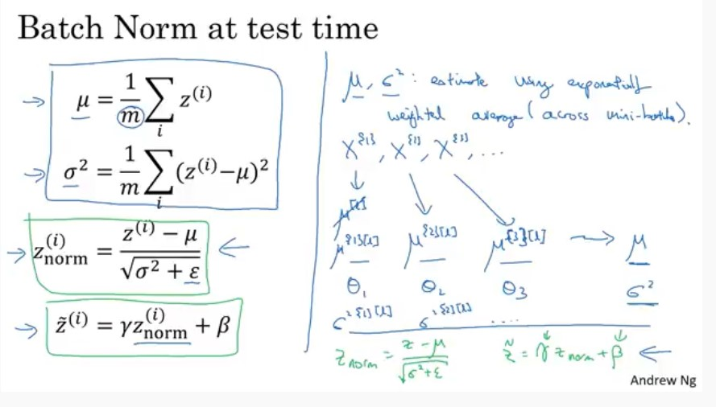

# Batch Norm At Test Time(by Andrew Ng)

Video link: https://www.youtube.com/watch?v=5qefnAek8OA

 이번 강의에서는 지난 Batch Normalization 강의에서 언급한 것처럼 테스트셋에서는 개별 sample별로 어떻게 Normalization을 적용하여 테스트를 진행할 것인지를 다뤄보자.

previous lecture review link: <a href="./Why does Batch Norm Work.md">go to markdown</a>

## Batch Norm at Test time

 위의 내용이 어떻게 테스트셋에서 각 하나의 샘플별에 대해서 Batch Normalization을 적용하여 평가를 진행하는지에 대한 설명이다. 

 학습 시에 Batch Normalization은 BATCH_SIZE로 지정한 m개의 sample을 가지는 mini-batch들로 나뉘며, 이 mini-batch별로 평균과 분산을 구하여 정규화를 진행하게 된다. $z^{(i)}_{norm}$이 바로 이 둘 값을 활용하여 구해지는 입력값 z들이며,  $\tilde{z}^{(i)}$는 추가로 gamma와 beta값으로 한번 더 조정한 것 뿐이다.

 그런데, 테스트셋을 활용하여 평가를 진행할 때는 학습시와 달리 mini-batch로 나누지 않는다. 그러면, 어떻게 평균과 표준편차를 계산하여 Batch Normalization을 수행할 수 있을까? 그 답은 독립적인 추정치를 활용하는 것이다. 여러 미니 배치를 거쳐 구한 지수가중평균을 추정치로 활용한다.

 예를들어 임의의 레이어를 고르게 되면, 그 레이어에는 X1, X2 ... 등의 mini-batch들의 입력값이 있게 된다. 그렇다면 X1 입력값에 대해서 지수 가중 평균을 활용하여 은닉층의 z값 평균의 추정치가 되고 표준편차 또한 동일하게 수행한다.

​	$X^{{1}} X^{{2}} ... X^{{n}}$

​	$\mu^{\{1\}[l]} \mu^{\{2\}[l]} ... \mu^{\{3\}[l]} $ => $\mu$

​	$\sigma^{\{1\}[l]} \sigma^{\{2\}[l]} ... \sigma^{\{3\}[l]} $ => $\sigma$

 마지막으로 이 값들을 활용하여 $z^{(i)}_{norm}$ 과 $\tilde{z}^{(i)}$를 계산하는 것이다. 이론적으로는 훈련셋을 활용하여 최종적으로 학습한 신경망의 평균과 표준편차를 얻을 수 있지만, 실제로는 학습하면서 평균과 표준편차 값을 추적하며 지수가중평균(이동평균)을 사용한다. 이 추정치를 가지고 테스트셋에서 활용하는 것이다.