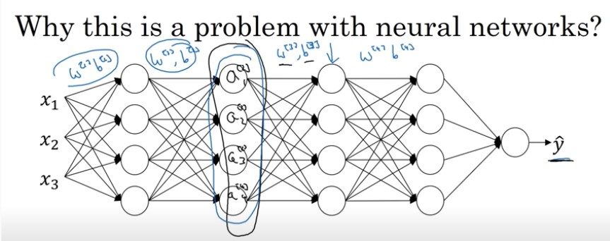
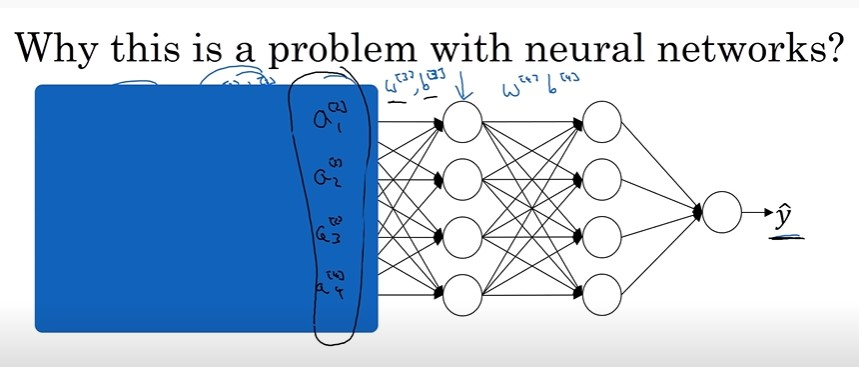

# Why does Batch Norm Work(by Andrew Ng)

Video link: https://www.youtube.com/watch?v=nUUqwaxLnWs&t=2s

이전강의에서 입력값 X를 평균 0, 분산 1로 정규화하는 것이 학습의 속도를 높이는 것을 살펴보았습니다. 입력 특성 X에 대해 비슷한 범위의 값을 가지도록 정규화하여 학습 속도를 높였다. 배치 정규화는 일차적으로 입력층, 은닉층 등에서 이와 같은 역할을 수행하지만 이는 여러가지 장점중 하나일 뿐이다.

이번 강의에서는 배치정규화가 어떤 또 다른 역할을 하는지 살펴보자.

"Covariant Shift"(공변량 변화)

: 데이터 분포가 변화하는 것?

X와 Y간의 대응의 학습시킬때, X에서 Y로 대응하는 함수가 바뀌지 않더라도, X의 분포가 바뀐다면 학습 알고리즘을 다시 학습해야한다는 것. 

e.g) 임의의 물체를 구분하는 신경망에서, 학습데이터 셋은 일반적인 데이터의 분포를 띄고 평가 데이터셋은 정규화된 데이터의 분포를 띈다면, 그에 대한 함수는 동일할지라도 학습이 올바르게 이루어질 수 없음.

그렇다면 어떻게 공변량 변화가 신경망에 적용될 수 있을까?

1. 후속 은닉층의 관점에서 학습의 용이성

 위와 같이 4계층으로 구성된 신경망이 있다고 가정하고, 우리는 3번째 은닉층의 입장에서 살펴보자. 3번째 은닉층의 역할은 앞에서 2번째 은닉층의 출력을 받아 $\hat{y}$을 예측하는 것이다.

 그렇다면, 앞의 2개의 은닉층을 무시하고 단순히 입력을 받는다고 생각해보자, 그렇다면 a1~a4까지의 입력을 받아 $\hat{y}$을 예측하는 것으로 생각할 수 있다. 그런데 그 입력으로 받는 a1~a4의 값이 바뀌면 어떻게 될까? 입력값의 분포가 바뀜으로 신경망은 공변량 변화 상황을 겪게된다. 이를 1번 그림과 같이 다시 확장하여 생각하면 우리의 신경망은 계속 이 상황을 겪는 것이다.

 여기서 배치 정규화는 은닉층 값들의 분포가 변화하는 양을 줄여주는 것이다. 위에서 언급한 것과 같이 은닉층에서 입력으로 들어오는 값은 계속 바뀔 것이다. 그런데 만약 배치 정규화를 통해서 은닉층의 입력값을 정규화한다면 적어도 은닉층에 입력으로 받는 입력값은 평균이 0이고 분산이 1인 분포를 유지할 수 있는 것이다. 그리고 굳이 그 분포가 평균이 0이고 분산이 1이 아니더라도, 계속 같은 수준의 평균과 분산의 값을 가지게 하는 것이다.

 앞선층에서 파라미터의 변경이 발생하여 입력으로 받는 값이 변화하더라도 학습에 사용하게 될 값의 분포를 제한하는 것이다. 입력을 안정화 함으로써 뒷쪽 층의 학습을 더 쉽게 유도한다.

2. 규제효과

 Batch Normalization은 Dropout 처럼 은닉층에 Noise를 부여함으로써 Regulation effect를 가져다준다. 이렇게 은닉층에 Noise를 주는 것은 학습 진행시 특정 은닉층에 과도하게 의존하는 것을 막음으로써 규제 효과를 주는 것이다.

* 작은 사이즈의 Mini-batch를 설정할 때,

   Dropout은 신경망의 학습 진행시, 특정 뉴런에 대해 가중치를 0과 1을 주어 곱셈 Noise를 부여한다. 하지만, Batch Normalization은 임의의 mini-batch의 평균과 분산값을 활용하여 Scaling을 수행한다. 그리고 Scaling을 하기 이전에 mini-batch를 선정하는 것부터 모집단에서 임의의 샘플을 추출하기 때문에 Noise를 가진다. 또한 앞서 Scaling을 적용하게 되면 표준편차로 나누는 곱셈 Noise와 평균 값을 빼는 덧셈 Noise를 주기 때문에 Regulation effect를 보여주게 된다.

   그러나, 이를 통해 생성되는 Noise는 작아서, Dropout과 함께 사용하는 경우도 있다.

* 큰 사이즈의 Mini-batch를 설정할 때,

   큰 사이즈의 Mini-batch는 표본으로 추출되는 값의 Noise가 모집단과 비교했을 때 작기 떄문에 Regulation Effect가 줄어들 것이다. 이 때문에 Batch Normalization을 규제효과를 위해 사용하지 않는다. 왜냐하면 이는 약간의 일반화 효과가 있었을 뿐, 이 때문에 의도가 왜곡된 것이다. 따라서, 본래의 의도인 깊은 은닉층의 학습을 용이하기 위한 목적으로 사용해야 한다.

3. 주의사항

 Batch Normalization은 하나의 mini-batch에 대한 평균과 분산값을 활용하여 정규화되어 사용된다. 그러나, 실제로 테스트셋을 학습할 떄는 이와 같은 mini-batch가 없고 한 번에 하나의 예시씩 처리하게 된다. 따라서 테스트 과정에서는 예측이 잘 되도록 조금 다른 접근이 필요하다. 따라서 다음 영상에서는 '예측을 할 수 있도록 배치 정규화를 이용한 신경망 학습방법'에 대해서 다루자.

Video link: https://www.youtube.com/watch?v=5qefnAek8OA

