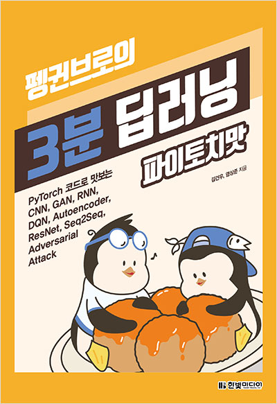

# 3-min-pytorch-review
<a href="https://www.hanbit.co.kr/store/books/look.php?p_code=B7193109877">김건우, 염상준 - 『펭귄브로의 3분 딥러닝 파이토치 맛』 (한빛미디어, 2019.11)</a>를 공부하여 내용을 정리합니다.

author's github source repo: <a href="https://github.com/keon/3-min-pytorch">click here</a> 

## :dart: ​목적

1. pytorch library에 대한 이해 및 사용법 습득
2. 지난번에 참여한 Dacon의 EMNIST 이미지 분류 대회에서 사용한 pytorch 코드의 개선점 탐색
3.  Kakao Areana Melon Playlist Continuation의 Auto Encoder를 활용한 추천시스템 구현을 위한 이해 

## :clipboard: 목차

1. <a href="https://github.com/JerryKwon/3-min-pytorch-review/blob/master/1.%20%EB%94%A5%EB%9F%AC%EB%8B%9D%EA%B3%BC%20%ED%8C%8C%EC%9D%B4%ED%86%A0%EC%B9%98/1.%20%EB%94%A5%EB%9F%AC%EB%8B%9D%EA%B3%BC%20%ED%8C%8C%EC%9D%B4%ED%86%A0%EC%B9%98.ipynb">딥러닝과 파이토치</a> (9/16)
2. <a href="https://github.com/JerryKwon/3-min-pytorch-review/blob/master/2.%20%ED%8C%8C%EC%9D%B4%ED%86%A0%EC%B9%98%20%EC%8B%9C%EC%9E%91%ED%95%98%EA%B8%B0/2.%20%ED%8C%8C%EC%9D%B4%ED%86%A0%EC%B9%98%20%EC%8B%9C%EC%9E%91%ED%95%98%EA%B8%B0.ipynb">파이토치 시작하기</a> (9/20)
3. <a href="https://github.com/JerryKwon/3-min-pytorch-review/blob/master/3.%20%ED%8C%8C%EC%9D%B4%ED%86%A0%EC%B9%98%EB%A1%9C%20%EA%B5%AC%ED%98%84%ED%95%98%EB%8A%94%20ANN/3.%20%ED%8C%8C%EC%9D%B4%ED%86%A0%EC%B9%98%EB%A1%9C%20%EA%B5%AC%ED%98%84%ED%95%98%EB%8A%94%20ANN.ipynb">파이토치로 구현하는 ANN</a>(9/22)
4. <a href="https://github.com/JerryKwon/3-min-pytorch-review/blob/master/4.%20%ED%8C%A8%EC%85%98%20%EC%95%84%EC%9D%B4%ED%85%9C%EC%9D%84%20%EA%B5%AC%EB%B6%84%ED%95%98%EB%8A%94%20DNN/4.%20%ED%8C%A8%EC%85%98%20%EC%95%84%EC%9D%B4%ED%85%9C%EC%9D%84%20%EA%B5%AC%EB%B6%84%ED%95%98%EB%8A%94%20DNN.ipynb">패션 아이템을 구분하는 DNN</a>(9/23~10/11)
5. <a href="https://github.com/JerryKwon/3-min-pytorch-review/blob/master/5.%20%EC%9D%B4%EB%AF%B8%EC%A7%80%20%EC%B2%98%EB%A6%AC%20%EB%8A%A5%EB%A0%A5%EC%9D%B4%20%ED%83%81%EC%9B%94%ED%95%9C%20CNN/5.%20%EC%9D%B4%EB%AF%B8%EC%A7%80%20%EC%B2%98%EB%A6%AC%20%EB%8A%A5%EB%A0%A5%EC%9D%B4%20%ED%83%81%EC%9B%94%ED%95%9C%20CNN.ipynb">이미지 처리 능력이 탁월한 CNN</a>(10/11~10/12)
6. <a href="https://github.com/JerryKwon/3-min-pytorch-review/blob/master/6.%20%EC%82%AC%EB%9E%8C%EC%9D%98%20%EC%A7%80%EB%8F%84%20%EC%97%86%EC%9D%B4%20%ED%95%99%EC%8A%B5%ED%95%98%EB%8A%94%20%EC%98%A4%ED%86%A0%EC%9D%B8%EC%BD%94%EB%8D%94/6.%20%EC%82%AC%EB%9E%8C%EC%9D%98%20%EC%A7%80%EB%8F%84%20%EC%97%86%EC%9D%B4%20%ED%95%99%EC%8A%B5%ED%95%98%EB%8A%94%20%EC%98%A4%ED%86%A0%EC%9D%B8%EC%BD%94%EB%8D%94.ipynb">사람의 지도 없이 학습하는 오토인코더</a>(10/13~10/15)
7. <a href="https://github.com/JerryKwon/3-min-pytorch-review/blob/master/7.%20%EC%88%9C%EC%B0%A8%EC%A0%81%EC%9D%B8%20%EB%8D%B0%EC%9D%B4%ED%84%B0%EB%A5%BC%20%EC%B2%98%EB%A6%AC%ED%95%98%EB%8A%94%20RNN/7.%20%EC%88%9C%EC%B0%A8%EC%A0%81%EC%9D%B8_%EB%8D%B0%EC%9D%B4%ED%84%B0%EB%A5%BC_%EC%B2%98%EB%A6%AC%ED%95%98%EB%8A%94_RNN.ipynb">순차적인 데이터를 처리하는 RNN</a>(10/25~10/26)
8. <a href="https://github.com/JerryKwon/3-min-pytorch-review/blob/master/8.%20%EB%94%A5%EB%9F%AC%EB%8B%9D%EC%9D%84%20%ED%95%B4%ED%82%B9%ED%95%98%EB%8A%94%20%EC%A0%81%EB%8C%80%EC%A0%81%20%EA%B3%B5%EA%B2%A9/8.%20%EB%94%A5%EB%9F%AC%EB%8B%9D%EC%9D%84%20%ED%95%B4%ED%82%B9%ED%95%98%EB%8A%94%20%EC%A0%81%EB%8C%80%EC%A0%81%20%EA%B3%B5%EA%B2%A9.ipynb">딥러닝을 해킹하는 적대적 공격</a>(10/27)
9. <a href="https://github.com/JerryKwon/3-min-pytorch-review/blob/master/9.%20%EA%B2%BD%EC%9F%81%ED%95%98%EB%A9%B0%20%ED%95%99%EC%8A%B5%ED%95%98%EB%8A%94%20GAN/9.%20%EA%B2%BD%EC%9F%81%ED%95%98%EB%A9%B0%20%ED%95%99%EC%8A%B5%ED%95%98%EB%8A%94%20GAN.ipynb">경쟁하며 학습하는 GAN</a>(10/27~)
10. 주어진 환경과 상호작용하며 학습하는 DQN